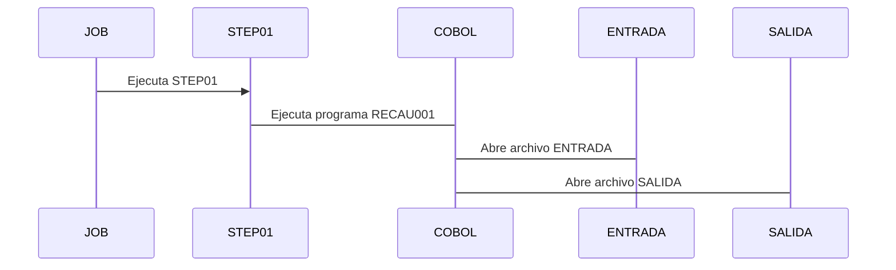

## ¿Qué es un Job?

> La unidad completa de trabajo batch que el sistema ejecuta.

En banca:

- Un cierre diario = 1 JOB
- Un proceso de recaudos = 1 JOB
- Un envío a contabilidad = 1 JOB

Un JOB puede tener :

- 1 STEP
- o 50 STEPs

# Forma general de un JOB

```jcl
//JOBRECAU  JOB   (1234),'RECAUDO SEGUROS'
//STEP01    EXEC  PGM=RECAU001
//ENTRADA   DD    DSN=SEGUROS.RECAUDOS.DIA,DISP=SHR
//SALIDA    DD    DSN=SEGUROS.RECAUDOS.PROC,DISP=(NEW,CATLG,DELETE)
```

### Regla de ORO del JCL

> Todo empieza con //

Si no empieza con //:

- No es [[jcl]]
- O es comentario
- O es parte de datos embebidos

## Explicando sintaxis

### Línea 1

| Parte             | Significado           |
| :---------------- | :-------------------- |
| JOBRECAU          | Nombre lógico del JOB |
| (1234)            | Cuenta / Proyecto     |
| 'RECAUDO SEGUROS' | Descripción           |

### STEP: El corazón del JOB

```jcl
//STEP01    EXEC  PGM=RECAU001
```

un STEP:

- Es una ejecución
- Puede ser:
  - Un programa [[100-projects/Dominar Cobol]]
  - Una utilidad del sistema

| Parte        | Significado        |
| :----------- | :----------------- |
| STEP01       | Nombre del paso    |
| EXEC         | Orden de ejecución |
| PGM=RECAU001 | Programa COBOL     |

> Un JOB = muchos STEPs
> Un STEP = una acción

### DD: los archivos

```jcl
//ENTRADA   DD    DSN=SEGUROS.RECAUDOS.DIA,DISP=SHR
```

Un DD:

- Define un archivo
- Le dice al programa:
  > "Este archivo se llama ENTRADA"

#### Relación con COBOL

```cobol
SELECT ENTRADA ASSIGN TO ENTRADA.
```

ENTRADA debe coincidir EXACTO
JCL conecta el archivo físico, COBOL lo usa

### Ejemplo



> Si falta un DD -> [[ABEND]]
> Si el nombre no coincide -> [[ABEND]]

## ¿Qué es DDNAME?

DDNAME(Data Definition Name):

> El nombre lógico que un programa ( COBOL, SORT, etc.) usa para referirse a un archivo.

Ejemplo:

```cobol
//PAGOS DD  DSN=BANCO.SEGUROS.PAGOS,DISP=SHR
```

- PAGOS -> DDNAME
- BANCO.SEGUROS.PAGOS -> nombre físico (DSN)

## ¿Qué es DSN?

DSN (Data Set Name):

> El nombre físico real del archivo en el mainframe.

Ejemplo:
BANCO.SEGUROS.PAGOS

Seria algo como:

- /data/banco/seguros/pagos.dat en Linux

## ¿Qué es [[DISP]]?

## ¿Qué es [[ABEND]]?
