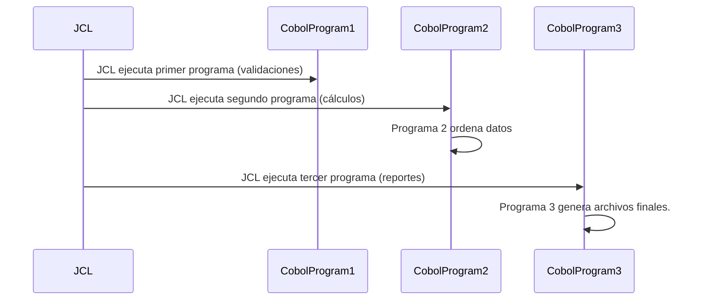

[[100-projects/Dominar Cobol]]

# ¿Que es un Proceso Batch?

> Un proceso automático, sin interacción humana, que procesa grandes volúmenes de datos siguiendo reglas estrictas.

Ejemplos reales:

- Cierre diario de cuentas.
- Recaudo de primas de seguros.
- Generación de extractos
- Pago de comisiones
- Reportes regulatorios
- Conciliaciones contables

> [!WARNING] No puede fallar

> [!WARNING] No puede duplicar

> [!WARNING] No puede perder datos

## Entonces ... ¿Dónde entra **JCL**?

> COBOL no se ejecuta solo

**COBOL:**

- No decide cuándo correr
- No sabe qué archivos usar
- No controla el orden de ejecución
- No maneja reintentos

## Rol de cada cosa

**JCL**

Es el orquestador

Decide:

- Qué programa se ejecuta
- Con qué archivos
- En qué orden
- Qué pasa si algo falla

**COBOL**

Es el trabajardor

Hace:

- Leer registros
- Aplicar reglas de negocio
- Calcular
- Generar salidas

**Archivos / DB**

Son:

- La memoria del banco
- La evidencia legal
- La base de auditoría



> JCL manda
> COBOL obedece

## ¿Qué es un [[Job]]

//Esto no va - Documentación BANCO(Revisar mejor)
Para que cada programa se ejecute en el computador y realice el trabajo para el cual fue diseñado debe procesarse en el Sistema Operativo. Esto significa que el programador, además de codificar el programa, debe realizar ciertas tareas de control d etrabajos para indicarle al Sistema Operativo la ejecución de dicho Programa y los archivos que utiliza. Las sentencias de control mencionadas se definen como **Job Control Language (JCL)**.

Cada sentencia de **JCL** se divide lógicamente en cinco campos. Estos no tienen que aparecer siempre en todas las sentencias. Los cinco campos en que se divide una sentencia **JCL** son:

1. **Identificador** El campo identificador indica al Sistema que se trata de una sentencia de **JCL** Las columnas 1 y 2 para todas las sentencias de **JCL** a excepción de la sentencia delimitadora o de termino, siempre son //. Las columnas 1 y 2 de la sentencia delimitadora consta de /_. Las columnas 1,2 y 3 de la declaración de comentario constan de //_ mas el texto del comentario.

2. **Nombre:** El campo de nombre identifica una sentencia en particular, debe empezar en la columna 3 con una longitud máxima de 8 caracteres y debe finalizar con espacio.
   Ej: //ABJ105D
3. **Operación:** El campo de operación especifica el tipo de sentencia de control **JCL**, las opciones son: **JOB, EXEC Y DD**. El campo debe ser precedido y seguido de por lo menos un espacio en blanco.
   Ej:// ABJ105D JOB

4. **Operadores:** El campo de operadores consiste de parámetros Posicionales y/o parámetros Keyword (Palabra clave), separados por comas y codificados después del campo operador hasta la columna 71 los parámetros posicionales se condifican primero en una secuencia especifica y luego se codifican los parámetros de palabra clave, estos últimos se identifican por una PALABRA CLAVE seguida por un signo igual.
   Ej parámetro posicional: // ABJ105D JOB (EEAB,1),'AB'
   Ej de parámetro keyword: //HACD9D05 EXEC PGM=ICEMAN
   //TCDF0000 DD DSN=CLFP.TC.FIX.STDRVSAM.TCDF0001,DISP=SHR

Un parámetro puede contener subparametros separados por comas dentro de un paréntesis.
Ej parámetros múltiples:

DISP=(NEW,CATLG,DELETE)
DCB=(DSORG=PS,LRECL=80,RECFM=FB,BLKSIZE=0) VOL=(,,,23)

Si los parámetros no caben en una sola línea se codifica hasta una coma y se continua en la siguiente comenzando con // en las columnas 1 y 2 y la continuación de los parámetros antes de la columna 16.
Ej continuación de sentencias:
//TCDF0000 DD DSN=CLFP.TC.FIX.STDRVSAM.TCDF0001,
// DISP=SHR
// DISP=(NEW,CATLG,DELETE)
// DCB=(DSORG=PS,LRECL=80,RECFM=FB,BLKSIZE=0)

# SENTENCIA JOB

Se usa para marcar el inicio de un proceso e indicarle al Sistema como se procesara este job.

Sintaxis:

```JCL
//jobname JOB positional-parameters [,keyword-parameters],[comments]
```

- **Campo nombre (jobname):** Se necesita una sentencia job para cada ejecución, el jobname debe ser único comenzando en la columna 3 con máximo 8 carácteres alfnuméricos seguido de un espacio.

- **Campo operación:** Se codifica la palabra job y debe estar precedida y sucedida por al menos un espacio en blanco.

- **Campo parámetros:**
  Ej:

  ```JCL
  //MPJCMAT0 JOB (EEMC,1),'MC',
  ```

  Parametros Posicionales:

  | Parámetros Posicionales                       | Valores                                                    | Propósito                                                                                              |
  | :-------------------------------------------- | :--------------------------------------------------------- | :----------------------------------------------------------------------------------------------------- |
  | (account-number[,accounting-information....]) | Número Contable de 1 a 4 caracteres Información contable.  | Especifica un número de Contabilidad y otro tipo de información contable si la Instalación lo require. |
  | Programmers-name                              | Nombre del programador que puede ser de 1 a 20 caracteres. | Especifica en nombre del programador, si la instación lo requiere.                                     |
